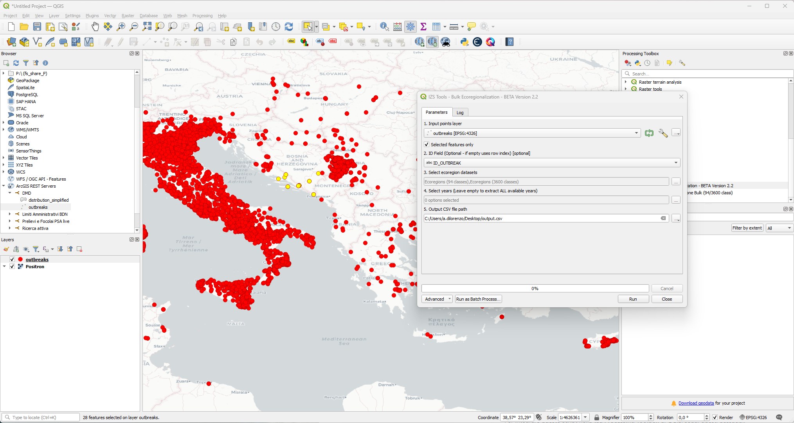

# PROVNA-QGIS-Processing-Tool

Questo strumento permette l'estrazione massiva delle classi di ecoregione da dataset ospitati su **Ellipsis Drive** direttamente all'interno di QGIS. È progettato per gestire grandi volumi di dati (es. migliaia di focolai) attraverso un sistema di interrogazione a blocchi (batching) per ottimizzare le performance delle API.

## 🚀 Caratteristiche
* **Dataset supportati:** Ecoregioni a 55, 94, 1600 e 3600 classi.
* **Serie Storica:** Estrazione automatica dell'intera serie disponibile (2018-2024) o selezione di anni specifici.
* **Batch Processing:** Gestione di query massive (pacchetti da 30 punti) per stabilità dell'endpoint REST.
* **Interfaccia Nativa:** Integrazione completa nella Toolbox di QGIS con supporto ai parametri dinamici.
* **Output:** Generazione di file CSV pronti per l'analisi statistica (separatore `;`).

---

## 🛠 Installazione e Configurazione

Per integrare questo script nella tua **Processing Toolbox** di QGIS, segui questi passaggi:

### 1. Ottenimento dello script
* Scarica il file `bulk_ecoregion_tool.py` direttamente da questa repository oppure clona l'intero progetto sul tuo computer.

### 2. Posizionamento dello script
Affinché QGIS riconosca lo script come un algoritmo di sistema, devi salvarlo nella cartella degli script del tuo profilo utente:
1. Apri **QGIS**.
2. Vai nel menu `Settings` (Impostazioni) > `User Profiles` (Profili Utente) > `Open Active Profile Folder`.
3. Nella cartella che si apre, naviga nel percorso: `processing` > `scripts`.
4. Incolla qui il file `bulk_ecoregion_tool.py`.

### 3. Attivazione in QGIS
1. Apri la **Processing Toolbox** (l'icona a forma di ingranaggio o scorciatoia `Ctrl+Alt+T`).
2. Clicca sull'icona **Python** in alto nella Toolbox e seleziona `Refresh` (Aggiorna).
3. Vedrai apparire una nuova cartella chiamata **IZS Tools**.
4. All'interno troverai l'algoritmo **Bulk Ecoregionalization - BETA Version 2.2**.

---

## 📖 Come usare lo strumento

L'interfaccia si presenta con i seguenti parametri:

1. **Input points layer**: Seleziona il layer puntuale caricato in QGIS. Lo script gestisce internamente la riproiezione in WGS84 (EPSG:4326).
2. **ID Field**: Scegli il campo che identifica univocamente il punto (es. `ID_OUTBREAK`). Se lasciato vuoto, verrà usato un indice progressivo.
3. **Select ecoregion datasets**: Spunta i modelli di ecoregione desiderati.
4. **Select years**: Seleziona uno o più anni. **Nota:** Se non viene selezionato alcun anno, lo script estrarrà automaticamente tutti gli anni disponibili.
5. **Output CSV file path**: Definisci il percorso e il nome del file di output.

---

## 📝 Note Tecniche
* **Requisiti:** Il plugin richiede le librerie Python `pandas` e `requests` installate nell'ambiente Python di QGIS.
* **Batching:** Lo script esegue chiamate cicliche per gruppi di 30 punti alla volta, garantendo la ricezione corretta dei dati senza interruzioni del server.

---

*Sviluppato per le esigenze di analisi spaziale dell'Istituto Zooprofilattico Sperimentale dell'Abruzzo e del Molise.*
